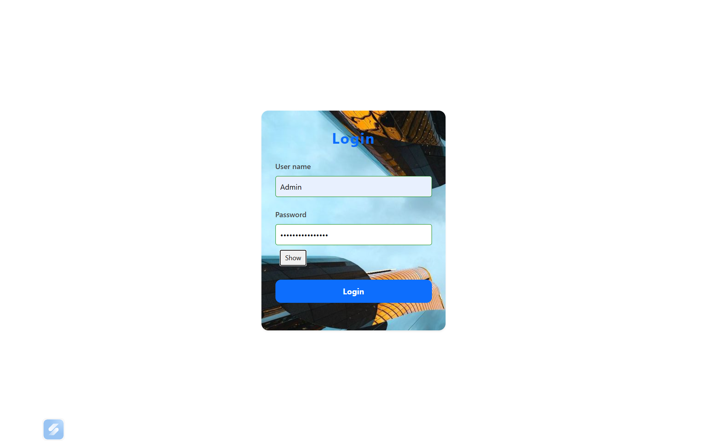
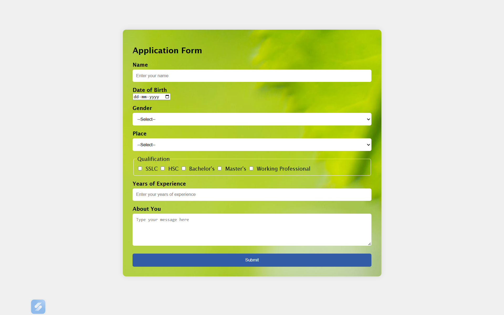
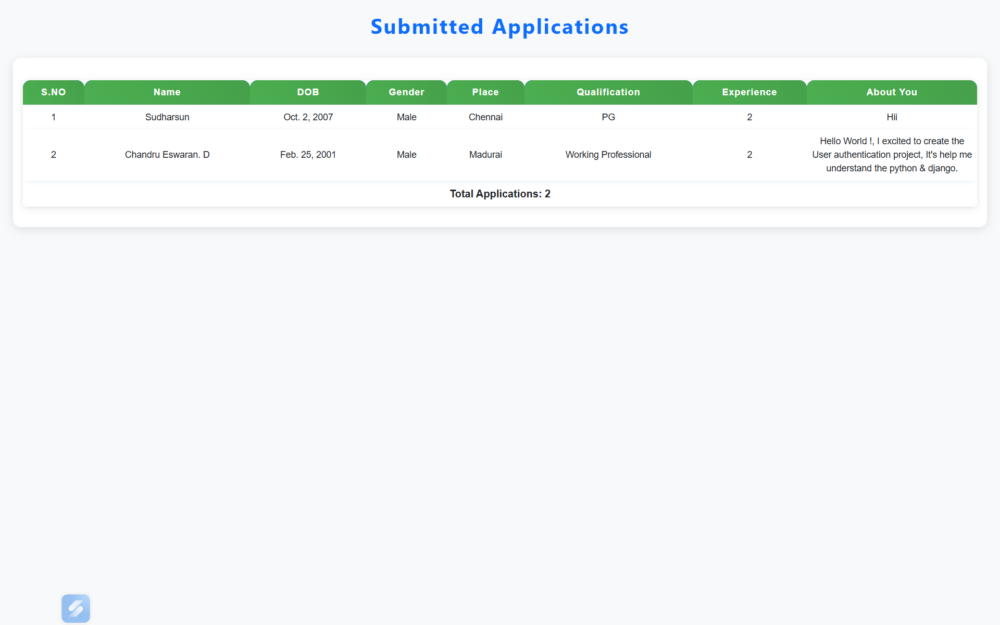

# 🔐 Django Login Project  

A simple **Python Django mini-project** that implements:  
✅ User **login & authentication**  
✅ Form handling with validation  
✅ Bootstrap-styled alerts for better UX  
✅ Admin setup to manage and view user details  
✅ Redirect to next page on successful login  

---

## 📸 Project Preview

---

## ⚡ Features

- 🔑 **User Authentication** – Secure login & logout using Django’s built-in auth system.  
- 📋 **Form Validation** – Real-time error handling for better user experience.  
- 🎨 **Responsive UI** – Styled with CSS3 + Bootstrap for a modern look.  
- 🛡️ **Secure Sessions** – Password hashing & Django’s in-built protection.  
- 🖥️ **Admin Dashboard** – Manage users & data via Django Admin panel.  
- ⚡ **Scalable Structure** – Modular Django app design for easy extension.  

---

## ⚡ Tech Stack

**Frontend:**  
   

**Backend:**  
 

**Database:**  

---

## 🤝 Contributing

Pull requests are welcome! If you’d like to improve this project, feel free to fork and contribute.

---

## 🌐 Connect with Me

👤 **Chandru Eswaran** 

  
 

